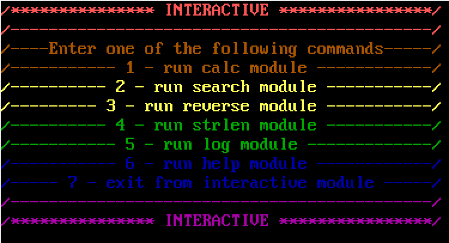
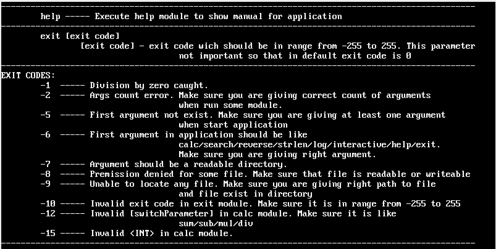

# [Laboratory work №1. Basics of shell scripts.](https://docs.google.com/document/d/16tm81Myzdr27izaz868YtuAKi9R75oVHFoZpp4J3LzI/edit)
---

## Using App
---
#### Once you've cloned my repository type:
```bash
App.sh [command] [parameters ..]
```
#### Basic commands
| Commands | Explain |
| ------- | :-------|
| **calc**| Calculate numbers|
| **search**| Recursive search strings in directory wich<br>satisfy by regular expression.|
|**reverse**| Write data from file to file by reversive order|
|**strlen**| Calculate length of string|
|**log**| Show warnings and information from<br>_**/var/log/anaconda/X.log**_|
|**interactive**| Start interactive menu where you can run any<br>func from app|
|**help**| Show help page about app|
|**exit**| Shutdown _App_ with exit code if exist
---
#### calc 
```shell
calc sum INT INT # sum of two INTs
----------------------------------
calc sub INT INT # substract of two INTs
----------------------------------
calc mul INT INT # multiplication of two INTs
----------------------------------
calc div INT INT # division of two INTs
```
#### search
```shell
search dir_name regular_expression
```
#### reverse
```shell
reverse file_to_read file_to_write
```
#### strlen
```shell
strlen some_string
```
#### log
    Just type log to see warnings and info ;)
#### interactive
    Just type interactive to see beauty menu and execute modules;)

#### help
    Just type help to see help page wich looks like man page
#### exit
```shell
exit exit_code_if_exist
```
---
#### Help  page 

